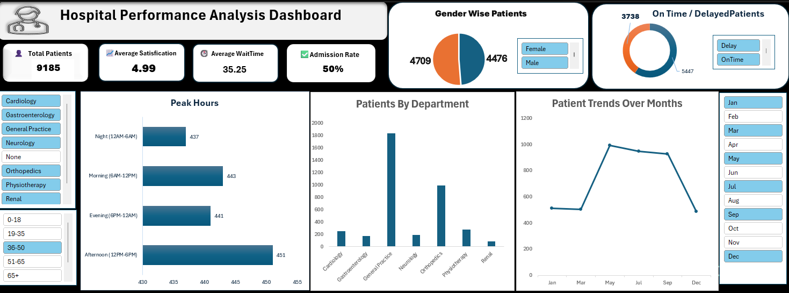

# Hospital Performance Analysis Dashboard

## Overview
This project is an interactive Excel dashboard designed to analyze hospital emergency room operations and patient flow.

It provides insights into patient volume, wait time, satisfaction, admission rates, and department-wise performance.

---

## Dashboard Preview

---

## Key KPIs
- Total Patients: 9,185
- Average Satisfaction: 4.99
- Average Wait Time: 35.25 minutes
- Admission Rate: 50%

---

## Features
- Interactive slicers for filtering data
- KPI cards for summary insights
- Department-wise patient distribution
- Peak hours analysis
- Patient trend over months
- On-time vs delayed patients

---

## Tools Used
- Microsoft Excel
- Power Query
- Pivot Tables
- Pivot Charts
- Slicers

---

## Key Insights
- Peak patient load occurs during afternoon hours
- General Practice handles the highest volume
- Patient volume increases mid-year
- Admission rate is approximately 50%

---

## Author
Mihir Saiya
